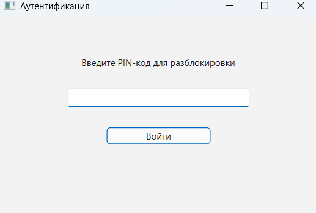
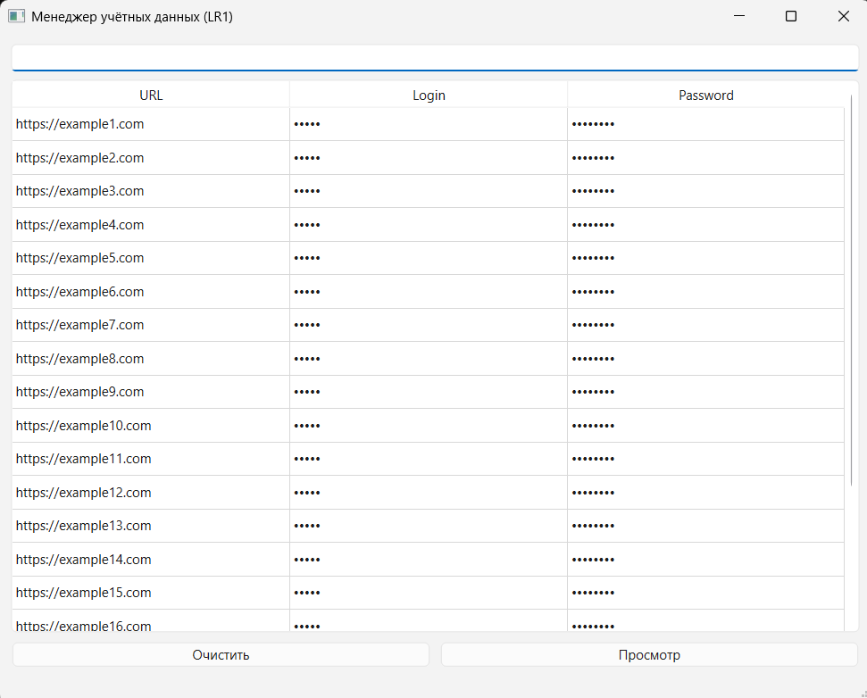
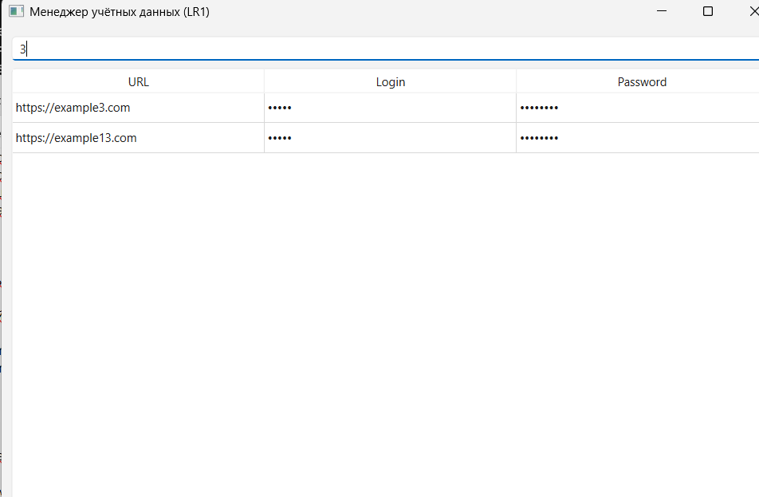
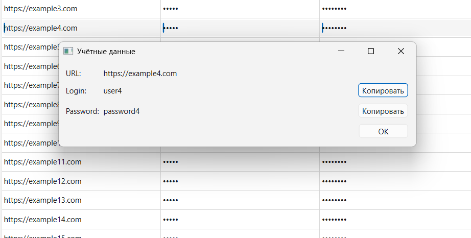
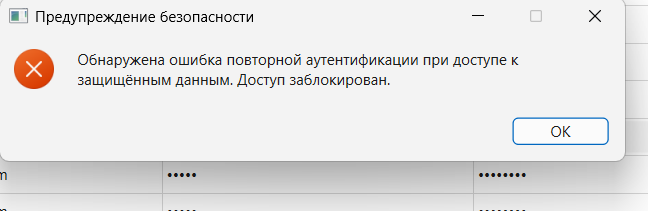
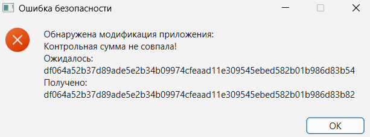
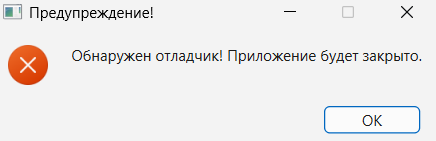
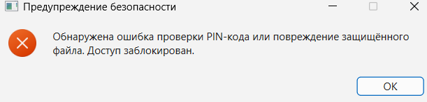

# Password Manager (LR1)

## Описание

В рамках данной лабораторной работы реализован менеджер учётных данных с механизмами защиты информации.  
Основной целью лабораторной работы является демонстрация практических методов защиты пользовательских данных, а также противодействие распространённым атакам на программные приложения.

Приложение реализовано на языке **C++** с использованием фреймворка **Qt** и криптографической библиотеки **OpenSSL**.  
Программа обеспечивает безопасное хранение учётных данных пользователей (URL, логин и пароль), используя многоуровневую систему защиты, включающую криптографическое шифрование, защиту от анализа памяти, антиотладочные механизмы и контроль целостности исполняемого файла.

Учётные данные хранятся в зашифрованном файле `creds.enc`, который шифруется алгоритмом **AES-256**.  
Ключ шифрования формируется динамически на основе пользовательского **PIN-кода**, который хешируется перед использованием.  
После успешной аутентификации данные расшифровываются и загружаются в память приложения.

Для предотвращения утечки данных из дампов оперативной памяти реализован **второй уровень шифрования**:  
логины и пароли хранятся в зашифрованном виде даже после расшифровки файла.  
Расшифровка конкретной учётной записи происходит только при явном запросе пользователя.

Также реализованы дополнительные механизмы защиты в соответствии с предоставленными требованиями:

- защита от кражи учётных данных из файла
- шифрование данных алгоритмом **AES-256**
- генерация ключа на основе PIN-кода
- второй слой шифрования данных в оперативной памяти
- защита от анализа памяти и credential dumping
- антиотладочная защита через `IsDebuggerPresent()`
- антиотладочная защита методом **self-debugging**
- проверка целостности программы через контрольную сумму сегмента `.text`
- блокировка доступа при обнаружении атаки

---

## Скриншоты

### Интерфейс менеджера учётных данных









---

### Предупреждения безопасности (на скриншотах представлены не все реализованные)









---

## Используемые технологии

- C++
- Qt 6
- OpenSSL
- Windows API
- AES-256
- SHA-256

---

## Сборка проекта

Проект собирается с использованием **Qt Creator и MSVC 2022**.

После сборки необходимо скопировать зависимости Qt:

```bash
windeployqt.exe LR_1.exe